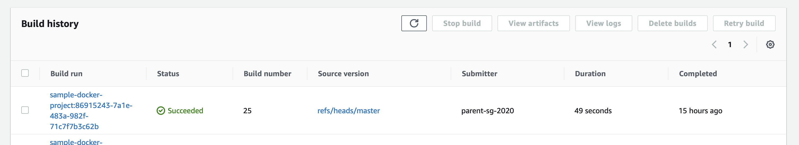
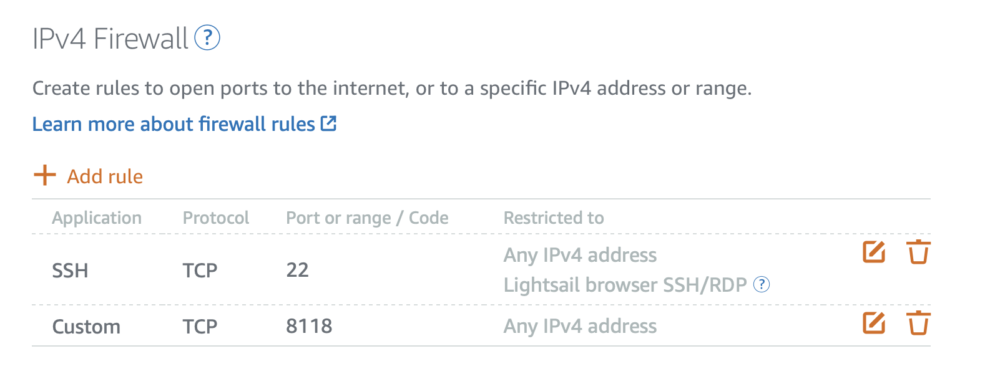
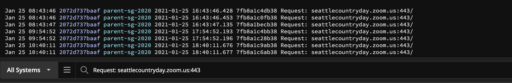

# privoxy
Zoom schoolers hate this. Find out how this weird trick stops your sons and daughters from going to YouTube and actually spend time listening to their teachers!

One of the funny thing that I realized is that even seemingly innocuous sites like google have a bunch of online HLTML5 games like snake and tic-tac-toe which can end up being significant time sinks. 


# AWS Setup
## Creating the docker build
I used [AWS CodeBuild](https://aws.amazon.com/codebuild/)


## Set up Lightsail
I picked the [easiest] (https://aws.amazon.com/about-aws/whats-new/2016/11/introducing-amazon-lightsail/) option of the AWS offerings to set up a server. It costs me around 10 dollars monthly.



## Deploying the docker container on Lightsail
```
 sudo apt-get install docker awscli
 export AWS_DKR=1234
 export PACKAGE_NAME=parent-bob
 sudo docker pull $AWS_DKR.dkr.ecr.us-west-2.amazonaws.com/$PACKAGE_NAME:latest
 sudo docker run --name parent-sg-2020 -p 8118:8118 -d --rm $AWS_DKR.dkr.ecr.us-west-2.amazonaws.com/$PACKAGE_NAME:latest
```
## Setting up papertrail 
After creating your [account] (https://papertrailapp.com/dashboard), you can run their docker image `logspout` 
```
export PAPERTRAIL_PORT=123
sudo docker run --name logspout -d --rm --volume=/var/run/docker.sock:/var/run/docker.sock gliderlabs/logspout syslog+tls://logs2.papertrailapp.com:$PAPERTRAIL_PORT
```

I find it very useful to see real time splunk like logs of the websites which are being accessed


# Laptop proxy setup
On a mac, go to Preferences -> Network -> Advanced -> Proxies and set up both HTTP&HTTPS proxies to point to your AWS Lightsail instances's Public IP.
